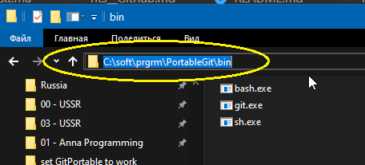
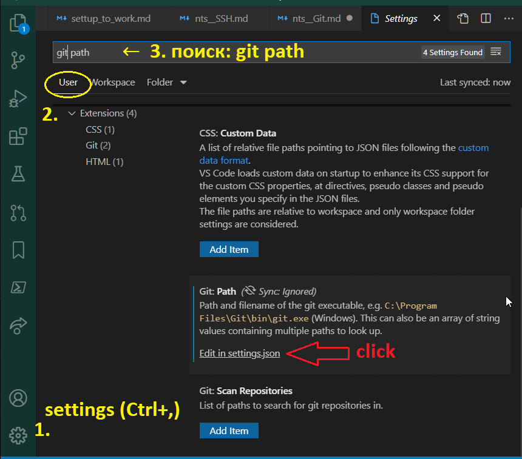
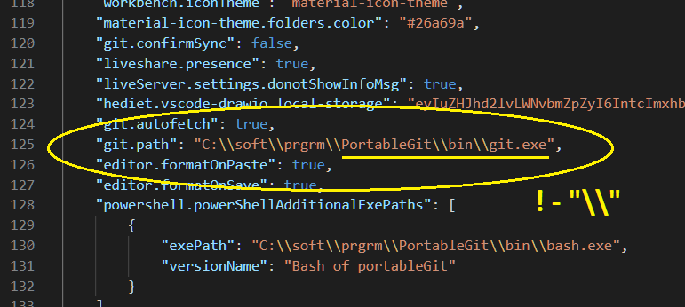
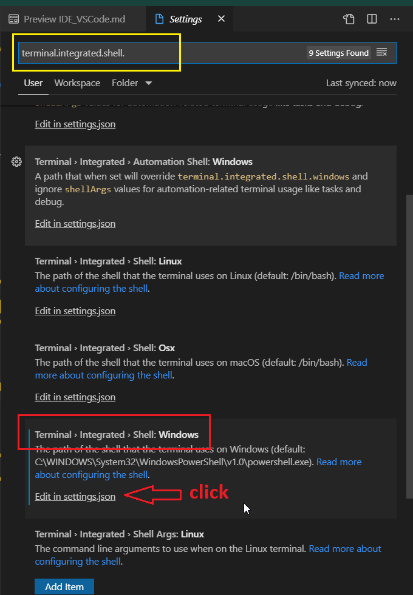
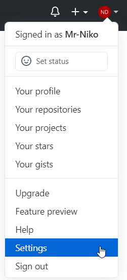
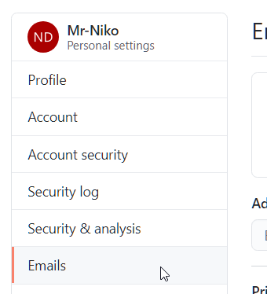
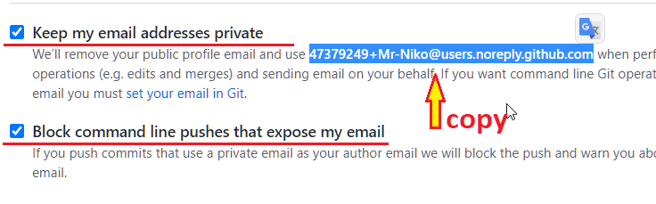

# using Git as Portable version

## A-Level

    ```bash
     $ ssh-keygen -t ed25519 -C "your_email@example.com"
     ```


## Настраиваем

### Table of content

- [выбрать *portable* версию](#prtblVersion)
- [Создать SSH-key](#newSSHkey) put here ref to "nts_SSH"

### 1. выбрать *portable* версию <a name="prtblVersion"></a>

- <span style="color:red">♦ открывая страницу начнется авто-загрузка стандартной версии - **отказаться**</span> так как нужна *portable* + 64-bit
- ссылка на скачивание: https://git-scm.com/download/win
&nbsp;

### 2. скаченный файл...

- `PortableGit-<ver.number>-64-bit.7z.exe` с расширением `*.7z.exe` - самораспаковывающийся архив;
- ...запустить там где будет находиться **данная программа**. Пусть распакуется сам, иначе, потребуется донастраивать. Папку тоже сам создаст.
&nbsp;

### 3. указать путь к *git.exe* в VS Code

- вар.1 ...ответить на всплываюещее окно в VS Code, справа внизу, и выбрать нужный файл *git.exe* из папки *bin*: `...\PortableGit\bin\git.exe`

- вар.2
  - скопировать нужный путь в папке в адресной строке

    

  - открыть файл настроек в *"нужном месте"*

    

  - вставив скопированный путь и добавить везде *slash "\\"* и... *git.exe*

    
&nbsp;

### 4. задать по умолчанию **bash.exe** (shell of unix like systems) в настройках VS Code параметр: *terminal.integrated.shell*

Повторяем п.3 только для параметра: `terminal.integrated.shell` и выглядеть в файле настроек будет примерно так:

  ```json
  "terminal.integrated.shell.windows": "C:\\soft\\prgrm\\PortableGit\\bin\\bash.exe",
  ```

&nbsp;

### 5. **Для справки!**

>**shell** - это оболочка между операционной системой и пользователем. Так в Windows это:
> - навигация по папкам с помощью *Explorer*
> - меню *Пуск*
> - *Панель задач* (как правило - внизу) и *Трей* (время, выбранный язык и пр.)
> - всемозможные окна настроек и параметров
>
> Все из перечисленного выше является частью *Windows Shell*, исполненного в графическом виде, "компьютерным" языком -  **GUI** (graphical user interface).
>
> Другой вариант, <span style="color:red">получить доступ ко всем настройкам операционной системы</span> **OS** (operating system) - это **CLI** (command-line interface) -т.е., простейшее окно за которым кроется *"движек"* выполняющий **текстовые команды**.
>
> Кстати, данный *"движек"* обозначается так-же **CLI** (command-line interpreter) с акцентом в последнем слове не на *Interface* (inter\между или interact\взаимодействовать + face\лицо = место, где соприкасаются две системы) а на *interpreter* (переводчик, толкователь).
>
>
> - ___Из плюсов:___ доступ ко всей операционной системе из одного окана.
> - ___Из минусов:___ требуется знание команд.
>
> Для Windows таким *"движком"* (повторим, внешне это простое окно, где можно печатать текст, а внутри - набор минипрограмм запускаемые *текстовой командой*)...
>
> - ...итак, для Windows официальным *"движком"* был\является **cmd.exe**; а в последнее время Microsoft продвигает **Power Shell** (название файла: pwsh.exe). 
> - Следующее первенство, по распространненности - **Bash** - используют на прошлых версиях Apple (macOS) и большинство Linux OS.

<!--   a) **Ctrl+,** 

   b)

   > ```json
   > "terminal.integrated.shell.windows": "C:\\soft\\prgrm\\PortableGit\\bin\\bash.exe",
   > ```
-->
&nbsp;

### 6. настроить приватность (чтобы адрес эл.почты не гулял по инету для спама) - *no-reply* GitHub email

ссылка на полную статью [origina article on Github](https://docs.github.com/en/free-pro-team@latest/github/setting-up-and-managing-your-github-user-account/setting-your-commit-email-address)

- GitHub предоставляет *no-reply* address на основе ID
- выглядит так: `ID+username@users.noreply.github.com`
- на примере Niko: 47379249+Mr-Niko@users.noreply.github.com

- a) на своей странице в GitHub https://github.com/mr-niko зайти в настройки

  
&nbsp;
- b) в настройках слева - *"Emails"*

  
&nbsp;
- c) выбрать эти две опции и скопировать свой ID (номер перед *ник-неймом* или весь адрес)

  
&nbsp;
- d) Попутно уменьшим колличество присылаемой почты самим GitHub

  
&nbsp;

### 7. Изменить путь\место хранения файлов конфигурации для Git, со стандартного, на компьютере, на *съемный носитель*

> Note!
>
> Git "смотрит" **файл конфигурации** в 4-х местах... если принудительно не стоит опция `--file <filename>` и выглядит это, на примере команд-опций, так:
>
> - `--system` самый высокий уровень - здесь настройки по умолчанию и те, что выбраны при установке программы Git
> - `--global` уровень пользователя, если на компьютере будут заходить под разными Ник-неймами то настройки не будут пересекаться, по умолчанию путь к папке настроег каждого пользователя находятся в переменной `%USERPROFILE%` например: `c:\users\<USERNAME>\` где и будет находиться скрытый файл `.gitconfig`. В мире Unix like OS (операционных систем на основе Unix) вместо `%USERPROFILE%` используются `$XDG_CONFIG_HOME` или `$HOME`
> - `--local` это уровень отдельно взятого репозитория-проекта. В папке с кодом\проектом из которой создается *репозиторий* создается скрытая папка (папка с "." в начале) `.git` вот в ней и будет файл конфигурации `.git/config`
> - `--worktree` работая с гит-проектом - репозиторием (repository) - создают ветки, ответлвления → для каждого из них можно задать отдельные\дополнительные настройки.
>
> Просмотрев все места возможного нахождения файлов конфигурации <span style="color:red">Git примет следующие настройки</span>:
>
> - низший уровень имеет приоритет над верхним, т.к. более конкретные настройки к "данной работе" имеют больший вес чем ОБЩИЕ.
> - все настройки ИСПОЬЗУЮТСЯ! Так, каждый параметр из файла конфигурации уровня  `--global`, не встреченый "ниже", тоже **будет действовать**.

- В portableGit `--system` config файл находится в `\PortableGit\etc\gitconfig`, значит уже на съемном носителе. Так же, нет проблем и с `--worktree` и `--local` - будут в месте нахождения репозитория проекта. А вот `--global`, по умолчанию, даже портабл версия ищет путь в переменной Windows `%USERPROFILE%`(как описано выше в заметке). <span style="color:red">Есть два варианта изменить ЭТО:</span>

  а) при каждом запуске portabelGit, с помощью *терминала*, временно менять содержание переменной windows `%USERPROFILE%`, а если Unix like OS, то `$HOME`.
  
  б) изменить файл настроек `~\PortableGit\etc\profile`
  > <span style="color:red">Note!</span> знак тильда "~" значит: любой путь до этой папки, который у каждого может быть свой; другое прочтение: домашняя папка папки "PortableGit".
&nbsp;


### - [?!] 10. Используя разные ресурсы (GitHub, GitLab etc) будем для каждого репозитария устанавливать *user.email*

## Sources

- README.portable (in folder of *portableGit*)
- Integrated Terminal [official](https://code.visualstudio.com/docs/editor/integrated-terminal)
- https://fofxacademy.com/how-to-setup-git-on-your-pc-for-multiple-github-accounts/
  - chapter:
What Happens When Git is not Configured for Multiple Accounts
- [using ConEmu](https://medium.com/fierce-punch-studios/portable-bash-cli-for-windows-13f52eb013c3)
  - 2nd place on [What are the best terminal emulators for Windows?](https://www.slant.co/topics/1552/~terminal-emulators-for-windows)
- [mingw](http://www.mingw.org/wiki/getting_started)
- [r-a-y notes](https://gist.github.com/r-a-y/da6c3b1b99aafcb3e97e311280aa9434)
- [youtube from JavaScript.ru](https://youtu.be/ePcY5dRdnPo?list=PLDyvV36pndZHkDRik6kKF6gSb0N0W995h&t=129)
- [Nov.2018 - Create a Portable IDE with Visual Studio Code](https://medium.com/@fawwazyusran/create-a-portable-ide-with-visual-studio-code-fb0c6bc198ef)
- PATH for the processes on a per session basis
- Git Bash command:

  ```
  cmd:  C:\> echo %USERPROFILE%
  bash: $ echo $USERPROFILE
  ps:     PS> echo $env:USERPROFILE
  
  list all variables

  cmd (docs):  C:\> SET
  bash (docs): $ printenv
  ps (docs):     PS> Get-ChildItem env:
  ```

  ```
  windows@location (master)
  $ git config --list --show-origin
  file:"C:\\ProgramData/Git/config" user.email=portal@example.com
  file:C:/_git/mingw64/etc/gitconfig user.name=Syster Sally
  file:C:/_git/mingw64/etc/gitconfig user.email=system@example.com
  file:C:/Users/Owner/.gitconfig user.email=global@example.com
  file:.git/config user.email=local@example.com
  ```
  - `cat ~/.gitconfig`
  - `echo $HOME` - show path of variable `%USERPROFILE%` (windows) or `$HOME` (Linux)
  - `git -c core.editor=ls\ -al config --system --edit`
  - `$ git config --global core.editor "'C:/Program Files/Notepad++/notepad++.exe' -multiInst -notabbar -nosession -noPlugin"`
  - `git config --global --list --show-origin`

  - MinGW64
    - `q` - for *quit* from big listing and at the end
    - Ctrl+d or `exit` - close terminal session

- [Integrated Terminal](https://code.visualstudio.com/docs/editor/integrated-terminal#_configuration) - config terminal of portable VS Code
  - path of config .json "C:\soft\prgrm\N.VSCode-1.50.0\data\user-data\User\settings.json"
  - shell cnfig
    - `terminal.integrated.shell.*`
    - `terminal.integrated.shellArgs.*`
    > !! if do it on workspace level needs whitelist the workspace to allow setting your shell, shell args and it's environment using the `Terminal: Manage Workspace Shell Permissions` command.
  - set the exact executable used in your settings file

    ```json
    // Command Prompt
    "terminal.integrated.shell.windows": "C:\\Windows\\System32\\cmd.exe"
    // PowerShell
    "terminal.integrated.shell.windows": "C:\\Windows\\System32\\WindowsPowerShell\\v1.0\\powershell.exe"
    // Git Bash
    "terminal.integrated.shell.windows": "C:\\Program Files\\Git\\bin\\bash.exe"
    ```

## ToDo

- ? new ver.: https://github.com/git-for-windows/git/releases/
- ? Windows Credential Manager
  - can be portable?
- [ A++ ] set git --global env in my path
  - a) `%USERPROFILE%` or `$HOME`src: ReadMe of portableGit
  - b) changing git file 
    - [srs 01 - dated 17 Nov 2010](https://markb.uk/portable-git-windows-setting-home-environment-variable.html)
      - <span style="color:red">[!?!</span> In the current version of Git for Windows, `git-bash.bat` doesn’t even exist
    - [src 02 - dated MAR 20TH, 2016](https://vincenttam.github.io/blog/2016/03/20/git-portable-home-path/)
      - he also read *srs 01*
      - he used:
        - [src 03 dated ](https://github.com/git-for-windows/git/issues/320#issuecomment-140278002)
        - [src 04 dated ](https://stackoverflow.com/users/5991/dgw)
    - [src 05 dated 10 years to 2 month](https://stackoverflow.com/questions/3454774/fix-msysgit-portable-home-location)
  - c - charly) check, if I can use Git wethout `--global` config file?
  - [x] d - delta) look site PortableApp - How did they do Git version?
        - [x] to look at the files needs do online instalation - it's not suits me
  - e - Echo) change $home env. in VS Code settings
    - file "C:\soft\prgrm\PortableGit\etc\profile" added at the end: `HOME=/c/soft/prgrm`
    - at Bash works the same: `HOME=/c/soft/prgrm`
  - f - foxtrot) [git sevral user config by path](https://deepsource.io/blog/managing-different-git-profiles/)
  - g - Golf): 

- [ A++ ] set for git config "default editor"
  - vim?
  - Emacs?
  - https://www.slant.co/topics/3772/~best-terminal-editors#12
  - micro - I can't check who developer are!
- VS Code
  - Terminal
    - use several tools in terminal
      - how to add portable terminal to VS Code?
    - what command can be used when starting Git
    - ? use and config cmd from *portableGit*
    - ? [Cmder](https://cmder.net/)
    - ? [PowerShell Core 6.0](https://docs.microsoft.com/en-us/powershell/scripting/whats-new/what-s-new-in-powershell-core-60?view=powershell-7)
      - VS Code + Power Shell [official](https://code.visualstudio.com/docs/languages/powershell)
  - set path to Git

## some notes

>[src](https://git-scm.com/docs/git-config#FILES) If not set explicitly with --file, there are four files where git config will search for configuration options:
> | Path   | Note |    read\write options    |
> |:---------|:-------------:|:------:|
> | unix like OS: 
>   - $XDG_CONFIG_HOME/git/config | | |
>
> The files are read in the order given above, with last value found taking precedence over values read earlier. When multiple values are taken then all values of a key from all files will be used.

 Each low level overrides values at the previous high level

1. System level (applied to every user on the system and all their repositories)

   - to view, `git config --list --system` (may need sudo)
   - to set, `git config --system color.ui true`
   - to edit system config file, `git config --edit --system`

2. Global level (values specific personally to you, the user).

   - to view, `git config --list --global`
   - to set, 
     - `git config --global user.name "xyz"`
     - `git config --global user.email "MY_NAME@example.com"`
     - `git config --global --unset-all user.name`
     - `git config --global --add user.name <whatever>`
   - to check
     - `git config --get user.name`
     - `git config --get-all user.name`
     
   - to edit global config file, `git config --edit --global`

> Note!
> 
> [*XDG Base Directory Specification*](https://specifications.freedesktop.org/basedir-spec/basedir-spec-latest.html) for Unix Like systems defines *environment variable* and *folder path* by default:
>
> | Env. variable   | Default path |    Purpose    |
> |:---------|:-------------:|:------:|
> | `$XDG_CACHE_HOME` | `$HOME/.cache/` | user-specific non-essential (cached) data |
> | `$XDG_CONFIG_HOME` | `$HOME/.config/`   | Application configuration and state |
> | `$XDG_DATA_HOME` | `$HOME/.local/share/` | Unique user-created data |

&nbsp;

3. Repository level (specific to that single repository)

   - to view, `git config --list --local`
   - to set, `git config --local core.ignorecase true` (--local optional)
   - to edit repository config file, `git config --edit --local` (--local optional)

4. choose config path for portableGit [youtube](https://youtu.be/ePcY5dRdnPo?list=PLDyvV36pndZHkDRik6kKF6gSb0N0W995h&t=243)

    [src](https://git-scm.com/docs/git-config#FILES) If not set explicitly with **option** `--file`, there are four files where git config will search for configuration options. <span style="color:red">The files are read in the order given below</span> , with last value found taking precedence over values read earlier. When multiple values are taken then all values of a key from all files will be used.

   - `--system` - setted by default or on instull proces - *"System-wide config file"*
     - windows OS
       - `C:\Program Files\Git\etc\gitconfig` - in the folder of instulled Git
         - or at *ProgramData* folder that has dif. path that varies from Windows versionscan be used variable `%APPDATA%\Git\config` or `%APPDATA%\.gitconfig`
     - unix like OS
       - `(prefix)/etc/gitconfig`

   - `--global`
     - windows OS
       - `~/.gitconfig`
         > *tilda* "~" - (Unix shell; windows Power Shell) means same as variable `$HOME` - **HOME 
         directory**, ...and [?] the same  `%USERPROFILE%` and = `%HOMEPATH%`
       - by default `c:\users\<USERNAME>\.gitconfig`
       - ex. of Windows 7: `C:\Users\Mark\`
     - unix like OS
       - `$XDG_CONFIG_HOME/git/config`
       - (if not set) `~/.config/git/config`
   - `--local` (default)
     - `<project>/.git/config`
     
>How do I view all settings?

- Run `git config --list`, showing system, global, and (if inside a repository) local configs
- Run `git config --list --show-origin`, also shows the origin file of each config item

> How do I read one particular configuration?

- Run `git config user.name "Mr-Niko"` to get user.name, for example.
- You may also specify options `--system`, `--global`, `--local` to read that value at a particular level.

> ? set configuration (--system, --global, --local)

`git config user.name "Mr-Niko"`

`git config user.email "47379249+Mr-Niko@users.noreply.github.com"`

## Configuration

### add portable [PowerShell Core](https://github.com/PowerShell/PowerShell)
- under *...download the PowerShell binary archives...* → Downloads (stable) → 64-bit


#### ? or [ZIP package](https://github.com/PowerShell/PowerShell/releases)

- you may need to unblock the file using the Unblock-File cmdlet
- unzip the contents to the location of your choice and run pwsh.exe from there
- for remoting over WSMan to work properly, ensure that you've met the [prerequisites](https://docs.microsoft.com/en-us/powershell/scripting/install/installing-powershell-core-on-windows?view=powershell-7#prerequisites)

### Git Components

#### [mingw](http://www.mingw.org/wiki/getting_started)
- `q` - after big listing to *quit*

#### Git Credential Manager Core (**GCM Core**)

- default credential helper since *"Git for Windows 2.29"* ver. and is included as an optional component of *"Git for Windows 2.28"*
- old ver. was [Git-Credential-Manager-for-Windows](https://github.com/microsoft/Git-Credential-Manager-for-Windows)