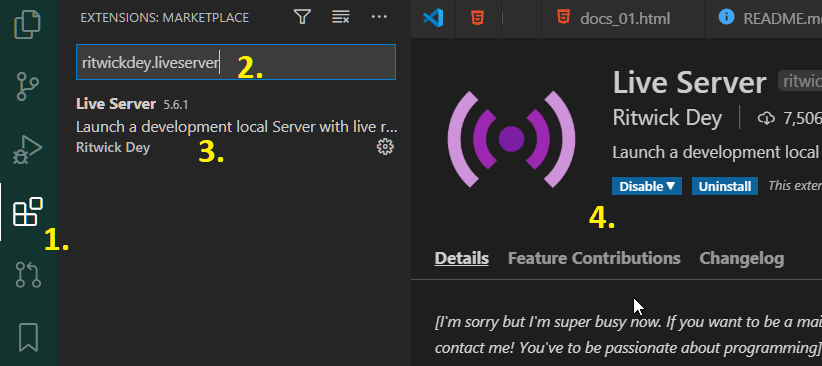

# Prepare before studying   *(Подготовить до занятий)*

## Settup extentions (установить расширения)

### a) Live Server *(для локального сервера)* ritwickdey.liveserver

>Что бы запускать макеты веб сайта с папки, как будто с интернета, нужен свой сервер. В данном случае - "Local Server" *(местный сервер)*. Цель этого - моделировать на самом компрьютере работу сайта но
не быть сервером для всего интернета.

Расширений есть несколько; будем использовать: ritwickdey.liveserver

>

### b) Live Share Extension Pack ms-vsliveshare.vsliveshare-pack   *(для дистанционной работы с общим кодом)*

> Установить так-же как предыдущее но после *первой* инсталляции перезапустить VS Code → он дозагрузит необходимые файлы. Сообщение об этом появится на нижней панельке.

## GitHub SSH (Secure Shell)

- toRead
  - [connecting to github with ssh](https://docs.github.com/en/free-pro-team@latest/github/authenticating-to-github/connecting-to-github-with-ssh)

  - [Managing deploy keys](https://docs.github.com/en/free-pro-team@latest/developers/overview/managing-deploy-keys)

### OpenSSH defaults

- TCP port – 22
- OpenSSH server config file – sshd_config (located in /etc/ssh/)
- OpenSSH client config file – ssh_config (located in /etc/ssh/)